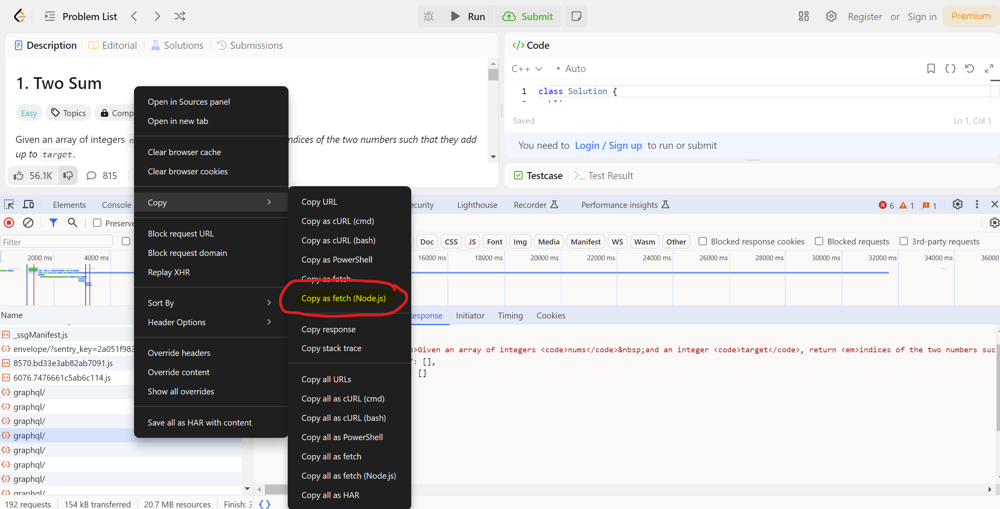
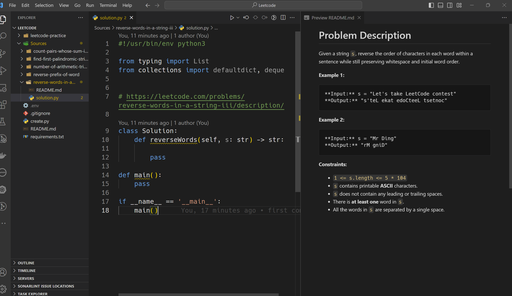

# Leetcode Question Fetcher (One at a time please)
I created a leetcode.com question fetcher today. I did this as I felt very lazy to do the same actions everytime I try to solve a new problem from leetcode.com.
I am sure that if you want to save your solved problems locally to your PC/Mac, you will have to create new file (using your own favorite editor/IDE) and
if you are like me that would like to store the actual question and some notes about solving the problem efficiently, then you will create a readme file too.

> [!IMPORTANT]  
> This won't fetch leetcode premium questions unless you have leetcode premium and add headers as per the instructions provided further below in this document.


> [!NOTE]  
> The code `create.py` provided "AS IS" would work only on questions that are publicly visible.

So I decided to create a python script to automate this. Some assumptions before:

I assume your root directory to be somewhere on your disk and let me call it as `LeetcodeProblems`. All the solutions would be created under this directory `LeetcodeProblems\Sources`.

The python script to do the job is `create.py`. Following python libraries are required:
```requirements.txt
html2text
requests
```

```JavaScript
fetch("https://leetcode.com/problems/flipping-an-image/description/", {
  // Only headers is required
  "headers": {
    "accept": "text/html,application/xhtml+xml,application/xml;q=0.9,image/avif,image/webp,image/apng,*/*;q=0.8,application/signed-exchange;v=b3;q=0.7",
    "accept-language": "en-IN,en;q=0.9,ta-IN;q=0.8,ta;q=0.7,en-GB;q=0.6,en-US;q=0.5",
    "cache-control": "max-age=0",
    "priority": "u=0, i",
    "sec-ch-ua": "\"Chromium\";v=\"124\", \"Google Chrome\";v=\"124\", \"Not-A.Brand\";v=\"99\"",
    "sec-ch-ua-mobile": "?0",
    "sec-ch-ua-platform": "\"Windows\"",
    "sec-fetch-dest": "document",
    "sec-fetch-mode": "navigate",
    "sec-fetch-site": "same-origin",
    "sec-fetch-user": "?1",
    "upgrade-insecure-requests": "1",
    "cookie": "<Replace this with what you get from your browser>"
  },
  // Below things are not required
  "referrerPolicy": "strict-origin-when-cross-origin",
  "body": null,
  "method": "GET"
});
```

To get the cookie follow this from your google-chrome browser via developer options & network tab. Allow the page to load and look for `graphql` requests as shown and click `Copy as fetch (Node.js)` option as shown in the picture below & convert it to a python dictionary.



Now you are ready to use this as follows:

The `create.py` script creates two files (assuming coding language is Python3):

* solution.py (with the skeleton code for you to just write the solution)
* A README.md file with the problem description as you see in leetcode problem link

It also updates the main README.md at the root of the directory with the solution link and leetcode problem link.

Use `create.py` as following:\
On Mac & Linux:
```
$ python3 create.py <leetcode-url> --coding_language=<your coding language choice>
```
On Windows:
```
C:\> python create.py <leetcode-url> --coding_language=<your coding language choice>
```

Coding language by default is Python3. You can choose from one of the following supported languages by leetcode:

- C++
- Java
- Python
- Python3 (Default)
- C
- C#
- JavaScript
- TypeScript
- PHP
- Swift
- Kotlin
- Dart
- Go
- Ruby
- Scala
- Rust
- Racket
- Erlang
- Elixir

Output of the finished product:



| [sort-array-by-parity](Sources/sort-array-by-parity/README.md) | https://leetcode.com/problems/sort-array-by-parity/description/ |
| [sort-array-by-parity](Sources/sort-array-by-parity/README.md) | https://leetcode.com/problems/sort-array-by-parity/description/ |
